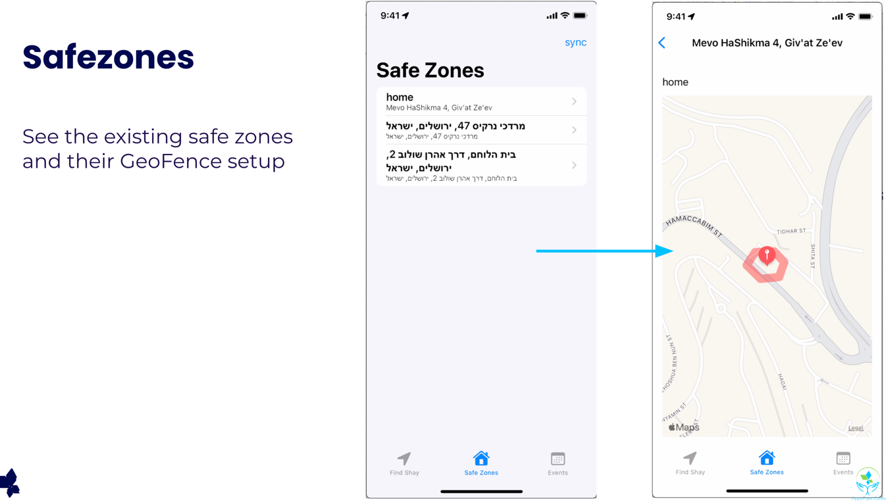

# restart-makers

This project was developed as a volunteering project for Restart-makers, as part of AppsFlyer team.
We developed a system to help Shai and his family in their daily activities.

*About Shai*:

Shai Mishali, Artillery Major & Marathon runner, who served in IDF 6 years until one month before ending his service he was critically injured in an operational action.
2 weeks in commah and 6 months between life and death, Shai and his family were facing challenging times. Luckily, and against all odds, Shai was standing on his feet after hard and long recovery.
One year ago, Shai completed 5km run during Jerusalem Marathon.

As a result from his injury, Shai lost his short term memory. This affects his day-to-day activities- Shai must have escort in his outdoor activities and is not independent in his daily tasks.
Our mission is to provide Avi, Shai’s father, and the rest of the Mishali family, a functional interface, that will allow them to monitor Shai’s activities and exact location during the day. 

